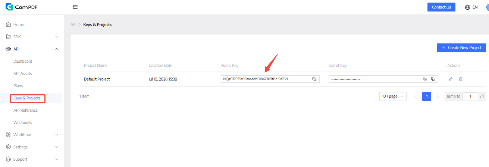

# ComPDF MCP

ComPDF MCP は、MCP クライアントおよび AI Agent プラットフォーム向けに設計されており、PDF／画像の解析とデータ抽出、PDF 変換、PDF 編集、画像変換などの機能を提供します。まず元のドキュメントを処理し、その後、より軽量でクリーンかつ構造化された結果を AI に渡すことで、AI Token の消費を抑え、AI コストを削減し、全体的な処理効率を高めることができます。

> * ComPDF MCP が役立ったら、ぜひ GitHub で ⭐ **Star** をお願いします。継続的な改善の大きな励みになります。
> * ご質問やアイデアがあれば、ぜひ [Discussions](https://github.com/ComPDFKit/compdf-mcp/discussions) にご参加ください。

<p align="center">
  <a href="#"></a>
  <a href="#"></a>
  <a href="#"></a>
</p>

<p align="center">
  <a href="#compdf-mcp-を選ぶ理由"><b>ComPDF MCP を選ぶ理由</b></a> •
  <a href="#対応機能"><b>対応機能</b></a> •
  <a href="#技術アーキテクチャ"><b>技術アーキテクチャ</b></a> •
  <a href="#クイックスタート"><b>クイックスタート</b></a> •
  <a href="#デプロイと運用"><b>デプロイと運用</b></a> •
  <a href="#license-と無料利用"><b>License と無料利用</b></a> •
  <a href="#利用シーンとサンプルプロンプト"><b>利用シーンとサンプルプロンプト</b></a> •
  <a href="#サポート"><b>サポート</b></a>
</p>

## ComPDF MCP を選ぶ理由

ComPDF MCP を利用する主な理由は、単に「AI に PDF を扱わせる」ことではありません。複雑で長文かつノイズの多い元ドキュメントを、モデルが理解しやすい入力へあらかじめ整形したうえで、AI に分析、要約、Q&A、自動化処理を任せられる点にあります。

元の PDF、スキャン文書、画像ファイルは、サイズが大きく、文脈のノイズが多く、構造も不安定になりがちです。先に ComPDF MCP で変換、抽出、ページ単位の処理を行い、その結果を AI に渡すことで、次のようなメリットがあります。

- AI Token の消費を削減できる
- AI 利用コストを抑えられる
- 応答時間を短縮できる
- 構造化された出力の品質を高められる
- ノイズの多い元ファイルをそのままモデルに投入する無駄を減らせる
- 1 つの MCP サービスで PDF と画像の処理をまとめて扱える
- ドキュメント中心のワークフローや複数プラットフォームの Agent 活用に適している

特に、レポート、契約書、請求書、表、スキャン文書などを一括処理するケースでは、この「まずドキュメントを処理し、その後 AI を呼び出す」方式のほうが、元ファイルを直接モデルへ渡すよりもコスト効率が高く、後続のワークフローにもつなげやすくなります。

## 対応機能

ComPDF MCP は、大きく 3 つの機能領域に対応しています。ドキュメント変換、PDF 操作、そしてインテリジェント解析とデータ抽出です。

### 1. PDF と画像の変換

| 機能                    | 説明                                                                                |
| --------------------- | --------------------------------------------------------------------------------- |
| PDF to Word           | PDF ファイルを編集可能な Word 文書へ変換し、元のレイアウト、テキスト、画像、書式をできる限り保持します。                         |
| PDF to Excel          | PDF ファイルを Excel に変換し、表、数値、構造化された業務データに対応します。                                      |
| PDF to PPT            | PDF ページを編集可能な PowerPoint スライドに変換し、元のレイアウトと視覚構造をできるだけ維持します。                        |
| PDF to HTML           | PDF ファイルを HTML に変換し、Web 表示やコンテンツ再利用に活用できます。テキスト、画像、表、レイアウトも保持します。                 |
| PDF to RTF            | PDF ファイルを RTF 文書に変換し、テキストおよび画像コンテンツに対応します。                                        |
| PDF to Image          | PDF ページを PNG または JPG 画像へ変換し、解像度や DPI の設定にも対応します。                                  |
| PDF to CSV            | PDF ファイルから表を抽出し、CSV として出力します。表ごとの出力にも、まとめて出力する形式にも対応します。                          |
| PDF to TXT            | PDF またはスキャン PDF からテキストを抽出し、プレーンテキストとして保存します。                                      |
| PDF to JSON           | PDF ファイルからテキスト、表、画像を抽出し、構造化 JSON として保存します。                                        |
| PDF to Markdown       | PDF ファイルを Markdown に変換し、ナレッジベース、開発ドキュメント、ブログシステム、AI ワークフローで再編集・検索・再利用しやすくします。     |
| PDF to Searchable PDF | スキャン PDF に OCR を実行し、検索・コピー・ハイライト可能なテキストを含む Searchable PDF を生成します。検索、保管、後続処理に便利です。 |
| PDF to OFD            | PDF ファイルを OFD に変換し、OFD 形式での保管、流通、ローカル業務環境での利用に対応します。                              |
| Word to PDF           | Word 文書を PDF に変換し、元のレイアウト、フォント、画像、ページ構造をできる限り保持したまま共有、保管、印刷に活用できます。               |
| PNG to PDF            | PNG 画像を PDF に変換し、スクリーンショット、デザイン素材、証跡画像などをまとめて整理、共有、印刷、保管しやすくします。                  |
| RTF to PDF            | RTF 文書を PDF に変換し、基本的な文字装飾やレイアウトを保ちながら、端末をまたいだ閲覧や正式出力に対応します。                       |
| Excel to PDF          | Excel ブックやスプレッドシートを PDF に変換し、レポート共有、印刷、保管、数式の誤編集防止に役立ちます。                         |
| TXT to PDF            | TXT テキストファイルを PDF に変換し、ログ、メモ、指示文書などを固定レイアウトの文書として整理できます。                          |
| CSV to PDF            | CSV の表データを PDF に変換し、スナップショット共有、レビュー、印刷、業務保管に活用できます。                               |
| PPT to PDF            | PowerPoint プレゼンテーションを PDF に変換し、配布、端末をまたいだ閲覧、正式な保存に適しています。                         |
| HTML to PDF           | HTML ページまたはコンテンツ断片を PDF に変換し、Web ページ保存、レポート出力、メール内容の保管、印刷用出力に活用できます。              |
| Image to Word         | JPG、JPEG、PNG、BMP 画像ファイルを編集可能な Word 文書に変換します。                                      |
| Image to Excel        | 画像ファイルを Excel ブックへ変換し、表、テキスト、数値コンテンツに対応します。                                       |
| Image to PPT          | 画像ファイルを編集可能な PowerPoint スライドに変換し、見た目のレイアウトと内容構造をできるだけ保持します。                       |
| Image to PDF          | JPG、JPEG、PNG、BMP などの画像ファイルを PDF に変換し、複数画像の取りまとめ、共有、印刷、保管を行いやすくします。                |
| Image to HTML         | 画像ファイルを HTML に変換し、テキスト、レイアウト、表、主要な視覚要素をできるだけ保持します。                                |
| Image to RTF          | 画像ファイルを RTF 文書に変換し、抽出されたテキストと画像に対応します。                                            |
| Image to CSV          | 画像ファイルから表を抽出し、CSV として出力します。                                                       |
| Image to TXT          | 画像ファイルからテキストを抽出し、プレーンテキストとして保存します。                                                |
| Image to JSON         | 画像ファイルからテキスト、表、画像を抽出し、構造化 JSON として保存します。                                          |

### 2. PDF の編集、保護、比較

| 機能          | 説明                                             |
| ----------- | ---------------------------------------------- |
| PDF ファイルの結合 | 複数の PDF ファイルを 1 つの PDF 文書にまとめます。               |
| PDF ファイルの分割 | 1 つの PDF ファイルを複数の小さな PDF ファイルに分割します。           |
| PDF ページの回転  | 指定した PDF ページを 90、180、270 度回転します。               |
| PDF ページの削除  | PDF ファイルから 1 ページまたは複数ページを削除します。                |
| PDF ページの挿入  | 既存の PDF に他の PDF からページを挿入します。                   |
| PDF ページの抽出  | 指定したページまたはページ範囲を抽出し、新しいファイルとして保存します。           |
| PDF 標準の変換   | PDF の適合標準またはアーカイブ標準を変換します。                     |
| 透かしの追加      | PDF ファイルにテキストまたは画像の透かしを追加し、ブランド表示や利用制御に活用できます。 |
| 透かしの削除      | 対応する PDF ファイルからテキストまたは画像の透かしを削除します。            |
| PDF の圧縮     | PDF ファイルサイズを小さくし、保存、アップロード、共有をしやすくします。         |
| PDF の暗号化    | AES 暗号化と権限制御により PDF ファイルを保護します。                |
| PDF の復号     | 権限がある場合に PDF ファイルのパスワードを解除し、内部処理や再利用をしやすくします。  |
| PDF の比較     | 2 つの PDF ファイルの内容差分を比較します。                      |

### 3. インテリジェント解析とデータ抽出

| 機能                      | 説明                                                       |
| ----------------------- | -------------------------------------------------------- |
| インテリジェント文書解析            | PDF と画像を構造化ドキュメントとして解析し、Agent、業務自動化、下流システムで利用しやすい形式にします。 |
| PDF と画像からのインテリジェントデータ抽出 | PDF や画像から、テキスト、表、内容フィールドなどの価値ある業務データを抽出します。              |

## 技術アーキテクチャ

本プロジェクトは、Python、FastMCP、Starlette を用いて構築された **MCP Streamable HTTP** サービスです。ツールのパラメータスキーマは、同梱されている公式 OpenAPI パラメータスナップショットから生成され、未定義のパラメータはサーバー側で拒否されます。

クライアントは、統合エンドポイント経由ですべてのツールにアクセスできます。

```text
http://127.0.0.1:8000/mcp
```

ComPDF MCP の一部機能だけを利用したい場合は、次のモジュール別エンドポイントを利用できます。

| モジュール            | MCP Endpoint          | 業務ツール数 | 主なツール                                                            |
| ---------------- | --------------------- | ------:| ---------------------------------------------------------------- |
| PDF と画像の変換       | `/mcp/conversion/mcp` | 28     | `pdf_to_word`、`pdf_to_markdown`、`image_to_json`、`word_to_pdf` など |
| インテリジェント解析とデータ抽出 | `/mcp/ai/mcp`         | 2      | `document_parse`、`document_extract`                              |
| PDF の編集、保護、比較    | `/mcp/pdf/mcp`        | 13     | `merge_pdf`、`add_watermark`、`encrypt_pdf`、`compare_pdf` など       |
| 全機能              | `/mcp`                | 44     | 上記すべてのツール                                                        |

すべての業務ツールは共通のファイル入力形式を使用します。`options` では ComPDF 公式ドキュメントで定義された camelCase のパラメータ名を使用する必要があります。`special_files` 経由でアップロードできるのは `htmlFile`、`templateFile`、`dataFile`、`imageFile`、`iccFile` のみです。

```json
{
  "files": [
    {
      "filename": "report.pdf",
      "content_base64": "JVBERi0xLjc...",
      "content_type": "application/pdf"
    }
  ],
  "options": {
    "pageRanges": "1-3,6",
    "enableOcr": 1
  },
  "special_files": {
    "imageFile": {
      "filename": "watermark.png",
      "content_base64": "iVBORw0..."
    }
  }
}
```

1 つの Base64 ファイルは、デコード後のサイズが 100 MB までに制限されています。同期ツールのレスポンスには、ComPDF の結果、対応する公式ドキュメント URL、そしてダウンロード URL が 24 時間で期限切れになる旨の説明が含まれます。

## クイックスタート

### 1. サービスのインストールと起動

前提条件: Python 3.10+。リポジトリのルートで仮想環境を作成し、editable モードでパッケージをインストールします。

Windows:

```powershell
python -m venv .venv
.venv\Scripts\Activate.ps1
pip install -e .
Copy-Item .env.example .env
compdf-streaming-mcp
```

Linux / macOS:

```bash
python3 -m venv .venv
source .venv/bin/activate
pip install -e .
cp .env.example .env
compdf-streaming-mcp
```

サービスはデフォルトで `0.0.0.0:8000` をリッスンします。次のエンドポイントで稼働状況を確認できます。

- `GET /healthz`: サービス状態とマウント済み MCP ルート
- `GET /readyz`: 上流の ComPDF API を呼び出さない readiness 状態
- `GET /metrics`: Prometheus テキスト形式のリクエストカウンタ

### 2. サービス設定

`.env.example` を `.env` にコピーし、デプロイ環境に合わせて設定を調整します。サーバー側では、ユーザーごとの ComPDF API Key を**保存も設定もしません**。各 MCP リクエストで、クライアントが `X-ComPDF-API-Key` ヘッダーを通じて自分の Key を渡します。[ComPDF Portal に登録](https://www.compdf.com/compdf-portal/signin?utm_source=github&utm_medium=referral&utm_campaign=compdf_mcp_repo_jp&ref_platform_id=github_compdf_mcp_jp)し、以下の場所から無料の API Key をコピーできます。



```dotenv
COMPDF_API_BASE_URL=https://api-server.compdf.com/server
COMPDF_API_TIMEOUT_SECONDS=180
MCP_HOST=0.0.0.0
MCP_PORT=8000
MCP_ALLOWED_HOSTS=localhost,localhost:*,127.0.0.1,127.0.0.1:*,mcp.example.com
MCP_RATE_LIMIT_PER_MINUTE=120
```

中国本土アカウントでは `COMPDF_API_BASE_URL=https://api-server.compdf.cn/server` を使用してください。本番環境では、リバースプロキシのドメインを `MCP_ALLOWED_HOSTS` に追加する必要があります。デフォルト以外のポートを使う場合はポート番号を明記するか、`mcp.example.com:*` を使用してください。

### 3. MCP クライアントの設定

以下の例では統合 MCP URL `http://127.0.0.1:8000/mcp` を使用します。リモート環境では、`https://your-domain.example/mcp` のような公開 HTTPS アドレスに置き換えてください。

まず個人用の ComPDF API Key を取得します（[登録すると無料 API Key を取得できます](https://www.compdf.com/compdf-portal/signin?utm_source=github&utm_medium=referral&utm_campaign=compdf_mcp_repo_jp&ref_platform_id=github_compdf_mcp_jp)）。環境変数を使用するクライアントでは、先にクライアントマシンで設定します。

```powershell
$env:COMPDF_API_KEY = "your-own-compdf-api-key"
```

#### Codex

`~/.codex/config.toml` にリモート MCP サービスを追加します。

```toml
[mcp_servers.compdf]
url = "http://127.0.0.1:8000/mcp"
env_http_headers = { "X-ComPDF-API-Key" = "COMPDF_API_KEY" }
tool_timeout_sec = 180
```

#### Claude (Claude Code)

ユーザー設定ファイル `~/.claude.json` に次の MCP サーバーを追加します。`COMPDF_API_KEY` は、Claude Code を起動するターミナルセッションで利用できる必要があります。

```json
{
  "mcpServers": {
    "compdf": {
      "type": "http",
      "url": "http://127.0.0.1:8000/mcp",
      "headers": {
        "X-ComPDF-API-Key": "${COMPDF_API_KEY}"
      }
    }
  }
}
```

`~/.claude.json` に既存の設定がある場合は、ファイル全体を上書きせず、既存の `mcpServers` オブジェクトに `compdf` を追加してください。

#### GitHub Copilot (VS Code)

VS Code のコマンドパレットで **MCP: Open User Configuration** を実行するか、ワークスペースに `.vscode/mcp.json` を作成し、次の設定を追加します。初回利用時に、VS Code がパスワード入力欄で API Key を要求します。

```json
{
  "inputs": [
    {
      "type": "promptString",
      "id": "compdf-api-key",
      "description": "ComPDF API Key",
      "password": true
    }
  ],
  "servers": {
    "compdf": {
      "type": "http",
      "url": "http://127.0.0.1:8000/mcp",
      "headers": {
        "X-ComPDF-API-Key": "${input:compdf-api-key}"
      }
    }
  }
}
```

#### Cursor

**Cursor Settings > Tools & MCP** を開き、**New MCP Server** を選択するか、`~/.cursor/mcp.json` を編集して次を追加します。

```json
{
  "mcpServers": {
    "compdf": {
      "url": "http://127.0.0.1:8000/mcp",
      "headers": {
        "X-ComPDF-API-Key": "your-own-compdf-api-key"
      }
    }
  }
}
```

この Cursor 設定では Key がローカル設定ファイルに保存されます。`~/.cursor/mcp.json` や Key を含むプロジェクトレベルの設定ファイルはコミットしないでください。

すべてのクライアントで、各 MCP リクエストに `X-ComPDF-API-Key` を送信する必要があります。この Key をツール引数、URL パラメータ、チャット本文として渡してはいけません。

### 4. 非同期処理と署名付きアップロード

44 個の同期業務ツールに加えて、各モジュールでは `list_operations` と次のタスクツールも提供します。

- `start_async_operation`: 対応する `/v2/processAsync/...` を呼び出し、時間のかかる処理や複数ファイル処理に対応します。
- `get_task_status`: `/v2/task/taskInfo` からタスク状態を照会します。
- `create_presigned_upload`、`upload_presigned_file`、`start_presigned_operation`: 署名付きタスクの作成、ファイルアップロード、タスク開始を順番に実行します。

署名付きアップロードは、通常ファイル 1 つを使う操作にのみ対応します。PDF の結合、比較、2 ファイル挿入、PDF 生成などは非同期モードを利用してください。署名付き URL は、作成元モジュールサーバーのメモリにのみ保持され、ツール引数やレスポンス項目として公開されません。

## デプロイと運用

Docker Compose を使用してサービスをビルドおよび起動できます。

```powershell
docker compose up --build
```

本番環境では、統合エンドポイント `https://your-domain.example/mcp` を HTTPS リバースプロキシ経由で公開し、`MCP_ENV=production`、`MCP_PUBLIC_URL`、`MCP_OAUTH_ISSUER_URL`、`MCP_STATIC_TOKENS_JSON` を設定してください。有効化後は、クライアントが `Authorization: Bearer <token>` も送信する必要があります。このサービストークンは、各ユーザーの ComPDF API Key とは別物です。イメージ転送、HTTPS プロキシ、更新、ロールバックの詳細は [DEPLOYMENT.md](DEPLOYMENT.md) を参照してください。

## License と無料利用

ComPDF MCP は無料で利用を開始でき、事前購入や営業への連絡は不要です。

- [登録](https://www.compdf.com/compdf-portal/signin?utm_source=github&utm_medium=referral&utm_campaign=compdf_mcp_repo_jp&ref_platform_id=github_compdf_mcp_jp)して無料の API Key を取得し、設定できます
  
- 個人での試用、機能検証、ワークフローテストに適しています
- より高い API 利用枠、エンタープライズ導入、商談をご希望の場合は、[営業チームへお問い合わせ](https://www.compdf.com/contact-sales?utm_source=github&utm_medium=referral&utm_campaign=compdf_mcp_repo_jp&ref_platform_id=github_compdf_mcp_jp)ください

これにより、より低いハードルで導入と試用を進められ、AI ドキュメントワークフローの実効性を確認したうえで、本格利用へ進みやすくなります。

## 利用シーンとサンプルプロンプト

PDF、画像、その他の元ファイルをアップロードし、表抽出、形式変換、PDF 結合、透かし追加などの指示を入力します。Agent は該当する ComPDF MCP ツールを呼び出して結果を返します。さらに深い分析が必要な場合は、処理済みの結果をその後 AI に渡します。

利用シーンの例:

* Claude、Cursor、Cline などの MCP クライアントで、ユーザーがレポート、マニュアル、提案書 PDF をアップロードし、まず Markdown や Word に変換したうえで、AI に要約、ナレッジ Q&A、コンテンツ再構成を依頼する
* 請求書、明細書、スキャン表、画像添付を扱う MCP ワークフローで、まず表と構造化データを抽出し、その後、経理確認、データ入力、自動振り分けに進む
* 契約書、入札資料、見積書、アーカイブ文書を Agent ワークフローで整理する際に、まず PDF の結合、分割、透かし追加、形式変換を行い、その後 AI に整理、命名、外部送付準備を任せる
* 複数ステップの自動化ワークフローで、まず PDF や画像を CSV、JSON、TXT などの軽量な出力へ変換し、その後の Agent が項目整理、承認フロー処理、ナレッジベース登録、スクリプト連携を行う

**サンプルプロンプト:**

* この PDF を Word に変換し、できるだけレイアウトを保持してください。
* この PDF からすべての表を抽出して CSV として出力してください。
* この画像を JSON に変換し、構造化コンテンツとして返してください。
* これらの PDF を結合し、透かしを追加して最終ファイルを返してください。
* まずこのレポートを Markdown に変換し、その後重要ポイントを要約してください。

---

<p align="center">
  <b>ComPDF チームによって開発されています。</b><br>
  <a href="https://www.compdf.com?utm_source=github&utm_medium=referral&utm_campaign=compdf_mcp_repo_jp&ref_platform_id=github_compdf_mcp_jp">公式サイト</a> ·
  <a href="https://www.compdf.com/contact-sales?utm_source=github&utm_medium=referral&utm_campaign=compdf_mcp_repo_jp&ref_platform_id=github_compdf_mcp_jp">営業へのお問い合わせ</a> ·
  <a href="https://www.compdf.com/support?utm_source=github&utm_medium=referral&utm_campaign=compdf_mcp_repo_jp&ref_platform_id=github_compdf_mcp_jp">テクニカルサポート</a>
</p>
